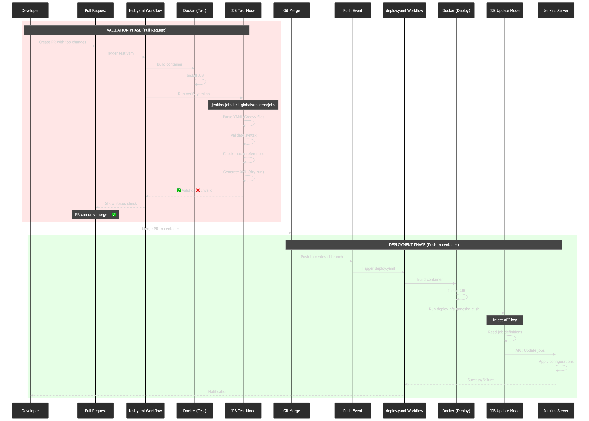

# GitHub Actions Workflow - Quick Guide

## Overview

This repository uses GitHub Actions to automatically validate and deploy Jenkins Job Builder (JJB) configurations.

**Two Workflows:**
1. **Validation** (`test.yaml`) - Runs on Pull Requests
2. **Deployment** (`deploy.yaml`) - Runs on merge to `centos-ci` branch

---

## Workflow Architecture



**Simple Flow:**
```
Developer → Pull Request → test.yaml (Validate) → Merge → deploy.yaml (Deploy) → Jenkins Updated
```

---

## 1. Validation Workflow (`test.yaml`)

**Trigger:** Pull Request to any branch

**What it does:**
- Builds Docker container with JJB
- Validates YAML syntax
- Checks macro references
- **Does NOT** connect to Jenkins

**File:** `.github/workflows/test.yaml`

```yaml
on:
  pull_request:
    branches: ['*']
steps:
  - Checkout code
  - Build Docker image
  - Run: jenkins-jobs test (validation only)
```

---

## 2. Deployment Workflow (`deploy.yaml`)

**Trigger:** Push to `centos-ci` branch

**What it does:**
- Builds Docker container with JJB
- Injects Jenkins API key
- Connects to Jenkins
- Creates/updates jobs

**File:** `.github/workflows/deploy.yaml`

```yaml
on:
  push:
    branches: ['centos-ci']
steps:
  - Checkout code
  - Build Docker image
  - Run: jenkins-jobs update (actual deployment)
```

---

## Supporting Files

### `tests/Containerfile`
Docker image with JJB installed

### `tests/verify-yaml.sh`
```bash
jenkins-jobs test globals/macros:jobs
```
Validates syntax without Jenkins connection

### `tests/deploy-nfs-ganesha-ci.sh`
```bash
sed "s/JENKINS_API_KEY/$JENKINS_API_KEY/g" tests/jenkins.conf > jobs/jenkins.ini
jenkins-jobs --conf jobs/jenkins.ini update jobs/:globals/macros/
```
Injects API key and deploys to Jenkins

### `tests/jenkins.conf`
JJB configuration template with API key placeholder

### `globals/macros/macros.yml`
Reusable JJB templates (SCM, parameters, triggers, etc.)

### `jobs/jjb/*.yaml`
Jenkins job definitions using JJB format

---

## How Files Work Together

```
Pull Request
    ↓
test.yaml → Containerfile → verify-yaml.sh → JJB (test mode)
    ↓
Validation Result → PR Status Check

Merge to centos-ci
    ↓
deploy.yaml → Containerfile → deploy-nfs-ganesha-ci.sh
    ↓
jenkins.conf + API Key → JJB (update mode)
    ↓
macros.yml + jobs/jjb/*.yaml → Jenkins API
    ↓
Jobs Created/Updated in Jenkins
```

---

## Testing Locally

```bash
# 1. Build container
docker build -t nfs-ganesha-ci-tests -f tests/Containerfile .

# 2. Test validation (like test.yaml)
docker run --rm nfs-ganesha-ci-tests:latest

# 3. Generate XML preview
docker run --rm -v $(pwd)/output:/output nfs-ganesha-ci-tests:latest sh -c \
  "jenkins-jobs test globals/macros:jobs/jjb -o /output --config-xml"

# 4. View generated XML
cat output/*/config.xml

# 5. Deploy to Jenkins (requires API key)
docker run --rm --env="JENKINS_API_KEY=your-token" \
  --entrypoint=tests/deploy-nfs-ganesha-ci.sh \
  nfs-ganesha-ci-tests:latest
```

---

## Quick Reference

**Jenkins Server:** https://jenkins-nfs-ganesha.apps.ocp.cloud.ci.centos.org

**Test locally:** `docker run --rm nfs-ganesha-ci-tests:latest`

**Deploy:** Push to `centos-ci` branch

**Monitor:** https://github.com/nfs-ganesha/ci-tests/actions